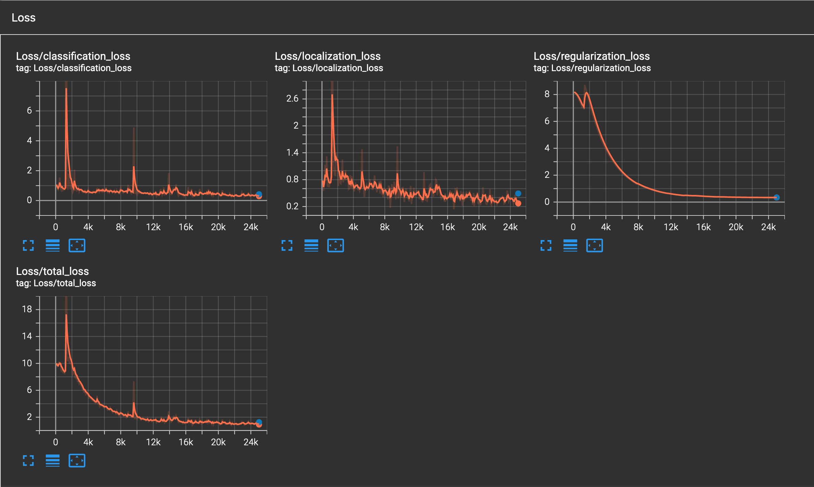

# Object Detection in an Urban Environment

## Data

For this project, we will be using data from the [Waymo Open dataset](https://waymo.com/open/).

[OPTIONAL] - The files can be downloaded directly from the website as tar files or from the [Google Cloud Bucket](https://console.cloud.google.com/storage/browser/waymo_open_dataset_v_1_2_0_individual_files/) as individual tf records. We have already provided the data required to finish this project in the workspace, so you don't need to download it separately.

## Structure

### Data

The data you will use for training, validation and testing is organized as follow:
```
/home/workspace/data/waymo
    - training_and_validation - contains 97 files to train and validate your models
    - train: contain the train data (empty to start)
    - val: contain the val data (empty to start)
    - test - contains 3 files to test your model and create inference videos
```

The `training_and_validation` folder contains file that have been downsampled: we have selected one every 10 frames from 10 fps videos. The `testing` folder contains frames from the 10 fps video without downsampling.

You will split this `training_and_validation` data into `train`, and `val` sets by completing and executing the `create_splits.py` file.

### Experiments
The experiments folder will be organized as follow:
```
experiments/
    - pretrained_model/
    - exporter_main_v2.py - to create an inference model
    - model_main_tf2.py - to launch training
    - reference/ - reference training with the unchanged config file
    - experiment0/ - create a new folder for each experiment you run
    - experiment1/ - create a new folder for each experiment you run
    - experiment2/ - create a new folder for each experiment you run
    - label_map.pbtxt
    ...
```

## Prerequisites

### Local Setup

For local setup if you have your own Nvidia GPU, you can use the provided Dockerfile and requirements in the [build directory](./build).

Follow [the README therein](./build/README.md) to create a docker container and install all prerequisites.

### Download and process the data

**Note:** ”If you are using the classroom workspace, we have already completed the steps in the section for you. You can find the downloaded and processed files within the `/home/workspace/data/preprocessed_data/` directory. Check this out then proceed to the **Exploratory Data Analysis** part.

The first goal of this project is to download the data from the Waymo's Google Cloud bucket to your local machine. For this project, we only need a subset of the data provided (for example, we do not need to use the Lidar data). Therefore, we are going to download and trim immediately each file. In `download_process.py`, you can view the `create_tf_example` function, which will perform this processing. This function takes the components of a Waymo Tf record and saves them in the Tf Object Detection api format. An example of such function is described [here](https://tensorflow-object-detection-api-tutorial.readthedocs.io/en/latest/training.html#create-tensorflow-records). We are already providing the `label_map.pbtxt` file.

You can run the script using the following command:
```
python download_process.py --data_dir {processed_file_location} --size {number of files you want to download}
```

You are downloading 100 files (unless you changed the `size` parameter) so be patient! Once the script is done, you can look inside your `data_dir` folder to see if the files have been downloaded and processed correctly.

### Classroom Workspace

In the classroom workspace, every library and package should already be installed in your environment. You will NOT need to make use of `gcloud` to download the images.

## Instructions

### Exploratory Data Analysis

You should use the data already present in `/home/workspace/data/waymo` directory to explore the dataset! This is the most important task of any machine learning project. To do so, open the `Exploratory Data Analysis` notebook. In this notebook, your first task will be to implement a `display_instances` function to display images and annotations using `matplotlib`. This should be very similar to the function you created during the course. Once you are done, feel free to spend more time exploring the data and report your findings. Report anything relevant about the dataset in the writeup.

Keep in mind that you should refer to this analysis to create the different spits (training, testing and validation).


### Create the training - validation splits
In the class, we talked about cross-validation and the importance of creating meaningful training and validation splits. For this project, you will have to create your own training and validation sets using the files located in `/home/workspace/data/waymo`. The `split` function in the `create_splits.py` file does the following:
* create three subfolders: `/home/workspace/data/train/`, `/home/workspace/data/val/`, and `/home/workspace/data/test/`
* split the tf records files between these three folders by symbolically linking the files from `/home/workspace/data/waymo/` to `/home/workspace/data/train/`, `/home/workspace/data/val/`, and `/home/workspace/data/test/`

Use the following command to run the script once your function is implemented:
```
python create_splits.py --data-dir /home/workspace/data
```

### Edit the config file

Now you are ready for training. As we explain during the course, the Tf Object Detection API relies on **config files**. The config that we will use for this project is `pipeline.config`, which is the config for a SSD Resnet 50 640x640 model. You can learn more about the Single Shot Detector [here](https://arxiv.org/pdf/1512.02325.pdf).

First, let's download the [pretrained model](http://download.tensorflow.org/models/object_detection/tf2/20200711/ssd_resnet50_v1_fpn_640x640_coco17_tpu-8.tar.gz) and move it to `/home/workspace/experiments/pretrained_model/`.

We need to edit the config files to change the location of the training and validation files, as well as the location of the label_map file, pretrained weights. We also need to adjust the batch size. To do so, run the following:
```
python edit_config.py --train_dir /home/workspace/data/train/ --eval_dir /home/workspace/data/val/ --batch_size 2 --checkpoint /home/workspace/experiments/pretrained_model/ssd_resnet50_v1_fpn_640x640_coco17_tpu-8/checkpoint/ckpt-0 --label_map /home/workspace/experiments/label_map.pbtxt
```
A new config file has been created, `pipeline_new.config`.

### Training

You will now launch your very first experiment with the Tensorflow object detection API. Move the `pipeline_new.config` to the `/home/workspace/experiments/reference` folder. Now launch the training process:
* a training process:
```
python experiments/model_main_tf2.py --model_dir=experiments/reference/ --pipeline_config_path=experiments/reference/pipeline_new.config
```
Once the training is finished, launch the evaluation process:
* an evaluation process:
```
python experiments/model_main_tf2.py --model_dir=experiments/reference/ --pipeline_config_path=experiments/reference/pipeline_new.config --checkpoint_dir=experiments/reference/
```

**Note**: Both processes will display some Tensorflow warnings, which can be ignored. You may have to kill the evaluation script manually using
`CTRL+C`.

To monitor the training, you can launch a tensorboard instance by running `python -m tensorboard.main --logdir experiments/reference/`. You will report your findings in the writeup.

### Improve the performances

Most likely, this initial experiment did not yield optimal results. However, you can make multiple changes to the config file to improve this model. One obvious change consists in improving the data augmentation strategy. The [`preprocessor.proto`](https://github.com/tensorflow/models/blob/master/research/object_detection/protos/preprocessor.proto) file contains the different data augmentation method available in the Tf Object Detection API. To help you visualize these augmentations, we are providing a notebook: `Explore augmentations.ipynb`. Using this notebook, try different data augmentation combinations and select the one you think is optimal for our dataset. Justify your choices in the writeup.

Keep in mind that the following are also available:
* experiment with the optimizer: type of optimizer, learning rate, scheduler etc
* experiment with the architecture. The Tf Object Detection API [model zoo](https://github.com/tensorflow/models/blob/master/research/object_detection/g3doc/tf2_detection_zoo.md) offers many architectures. Keep in mind that the `pipeline.config` file is unique for each architecture and you will have to edit it.

**Important:** If you are working on the workspace, your storage is limited. You may to delete the checkpoints files after each experiment. You should however keep the `tf.events` files located in the `train` and `eval` folder of your experiments. You can also keep the `saved_model` folder to create your videos.


### Creating an animation
#### Export the trained model
Modify the arguments of the following function to adjust it to your models:

```
python experiments/exporter_main_v2.py --input_type image_tensor --pipeline_config_path experiments/reference/pipeline_new.config --trained_checkpoint_dir experiments/reference/ --output_directory experiments/reference/exported/
```

This should create a new folder `experiments/reference/exported/saved_model`. You can read more about the Tensorflow SavedModel format [here](https://www.tensorflow.org/guide/saved_model).

Finally, you can create a video of your model's inferences for any tf record file. To do so, run the following command (modify it to your files):
```
python inference_video.py --labelmap_path label_map.pbtxt --model_path experiments/reference/exported/saved_model --tf_record_path /data/waymo/testing/segment-12200383401366682847_2552_140_2572_140_with_camera_labels.tfrecord --config_path experiments/reference/pipeline_new.config --output_path animation.gif
```

## Submission Template

### Project overview
This section should contain a brief description of the project and what we are trying to achieve. Why is object detection such an important component of self driving car systems?

### Set up
Training was performed using the included Docker image on a GTX 1070. This setup is sufficient for fine tuning a pretrained model, but for a full training, a GPU with more memory and mixed precision support would perform much better.

Two changes were made to the Docker image. The Keras version was downgraded from 2.8 to 2.5 due to an version compatibility error, and Seaborn was added for data exploration. 

### Dataset
#### Dataset analysis
Initially, we want to get some overall sense of the data. I start by creating an iterable of the dataset to see how each observation is stored. I made a small modification to the `get_dataset` function, such that the data loader can load all TFRecord files at once. Then I created the dataset with the following command:

```
data_dir = Path("/app/project/data/training_and_validation/")
dataset = get_dataset([i.as_posix() for i in data_dir.rglob("*tfrecord")])
```

I start by inspecting the keys of a single observation.

```
next(iter(dataset)).keys()

>>> dict_keys(['image', 'source_id', 'key', 'filename', 'groundtruth_image_confidences', 'groundtruth_verified_neg_classes', 'groundtruth_not_exhaustive_classes', 'groundtruth_boxes', 'groundtruth_area', 'groundtruth_is_crowd', 'groundtruth_difficult', 'groundtruth_group_of', 'groundtruth_weights', 'groundtruth_classes', 'groundtruth_image_classes', 'original_image_spatial_shape'])
```

Each observation contains a ditionary with a `640x640x3` tensor for the image, and ground truth data for boxes and classes.

The next step is to visualize the image and boxes. The function below takes a batch and adds the ground truth boxes to the image. Cars are labelled in red, people green, and cyclists blue.

```
def display_instances(batch, ax=None):
    """
    This function takes a batch from the dataset and display the image with 
    the associated bounding boxes.
    """
    if ax==None:
        fig, ax = plt.subplots(figsize=(10,10))
    ax.imshow(batch['image'])
    boxes = np.array(batch['groundtruth_boxes'])
    classes = np.array(batch['groundtruth_classes'])
    boxes[:,0] = boxes[:,0]*batch['image'].shape[0]
    boxes[:,2] = boxes[:,2]*batch['image'].shape[0]
    boxes[:,1] = boxes[:,1]*batch['image'].shape[1]
    boxes[:,3] = boxes[:,3]*batch['image'].shape[1]
    for box, obj_class in zip(boxes, classes):
        color = 'r' if obj_class==1 else 'g' if obj_class==2 else 'b'
        rect = patches.Rectangle((box[1], box[0]), box[3]-box[1], box[2]-box[0], linewidth=1, edgecolor=color, facecolor='none')
        ax.add_patch(rect)
```

We can display a set of images using the Matplotlib subplots function.

```
fig, axs = plt.subplots(nrows=5, ncols=2, figsize=(5,15))
iterator = iter(dataset.take(10))
for i in range(2):
    for j in range(5):
        display_instances(next(iterator), axs[j, i])
```

Below is a random sample of ten images with ground truth labels.


We can see that the images come from a variety of urban environments, ranging from dense urban cores, to suburban residential areas.

Next, I collect statistics on a random sample of 50,000 images, and plot the distributions of their features. 

The violin plots below show the distributions of object counts across the images.


We can see that cars are the most common, with most images containing between 1 and 30 cars, and with some images containing up to 70. The number of people in each image more closely follows a typical exponential distribution, with most images having 0 or 1 person, and a few outliers having as many as 45 people. Cyclist follow an even more pronounced exponential distribution. Most images contain no cyclist, and those that do typically have 1 or 2.

Plotting the histograms of each category provides more detail on the distributions.


Interestingly, over 3000 images actually contain no cars at all. But this isn't all that surprising. The example images from earlier included one such image, with no cars and only a cyclist. About half of images contain no people, and most images contain no cyclists.

Beyond knowing how many boxes each image contains for each category, it's also useful to see the distribution of box areas. Some models can struggle to detect objects of widely ranging size within the image, so knowing the size of object can help us decide what model to use. For example, using a feature pyramid network adds some computational complexity to the model, but helps it to detect objects of different size.


This is an extremely long tailed distribution, so it helps to get the percentiles as well.

```
np.percentile(areas, [i for i in range(100)])

>>>array([2.65932381e-01, 7.97816372e+00, 1.12358303e+01, 1.43606949e+01,
       1.70199795e+01, 1.98789463e+01, 2.26045799e+01, 2.48653107e+01,
       2.76572628e+01, 2.97848625e+01, 3.24132195e+01, 3.51035538e+01,
       3.76964493e+01, 4.00530434e+01, 4.25498466e+01, 4.52093582e+01,
       4.82011414e+01, 5.15252419e+01, 5.38521423e+01, 5.70434799e+01,
       5.98359566e+01, 6.32932549e+01, 6.70158463e+01, 6.98083420e+01,
       7.31330719e+01, 7.67896347e+01, 8.03794556e+01, 8.47007141e+01,
       8.81583328e+01, 9.33440933e+01, 9.87290726e+01, 1.03050568e+02,
       1.07704979e+02, 1.12793381e+02, 1.18475471e+02, 1.24458641e+02,
       1.29643967e+02, 1.34630585e+02, 1.40543259e+02, 1.46930573e+02,
       1.54575317e+02, 1.61690094e+02, 1.69135651e+02, 1.76183739e+02,
       1.85491287e+02, 1.93071075e+02, 2.01180832e+02, 2.09425430e+02,
       2.19038986e+02, 2.29683929e+02, 2.41737000e+02, 2.53903290e+02,
       2.65671204e+02, 2.78104309e+02, 2.93208588e+02, 3.09425934e+02,
       3.22515472e+02, 3.38538025e+02, 3.57419434e+02, 3.75924992e+02,
       3.93897369e+02, 4.14929535e+02, 4.38458466e+02, 4.62092499e+02,
       4.85866882e+02, 5.09934448e+02, 5.38122986e+02, 5.66845215e+02,
       6.01351074e+02, 6.37451721e+02, 6.71557373e+02, 7.10046631e+02,
       7.52934631e+02, 7.97346436e+02, 8.47675354e+02, 9.03156250e+02,
       9.64952332e+02, 1.02951013e+03, 1.10576648e+03, 1.17677502e+03,
       1.26852148e+03, 1.37196960e+03, 1.49079382e+03, 1.61623039e+03,
       1.76165552e+03, 1.92392334e+03, 2.13015845e+03, 2.37069775e+03,
       2.64107837e+03, 2.99059717e+03, 3.40652319e+03, 3.86154321e+03,
       4.54220996e+03, 5.41051270e+03, 6.44226318e+03, 8.14951318e+03,
       1.03183711e+04, 1.47502568e+04, 2.23177910e+04, 3.66359609e+04])
```

Most boxes are on the order of hundreds of pixels, while the top 1% are around 36,000 pixels. The images are `640x640=409600` pixels in area, so that means that most objects only take up a few percent of the image area, while the top 1% start at objects taking up a little less than 10%. The long tail also shows that some objects take up nearly the entire image.

Finally, notice that some images are much brighter than others. In particular, some images taken at night are very dark. We can get the distribution of image brightness by taking the mean pixel intensity of each image.


#### Cross validation
Model training was validated using a random split of the dataset into 80% training, 10% validation, and 10% testing. The random split was performed per file using the function

```
def split(source, destination):
    """
    Create three splits from the processed records. The files should be moved to new folders in the
    same directory. This folder should be named train, val and test.

    args:
        - source [str]: source data directory, contains the processed tf records
        - destination [str]: destination data directory, contains 3 sub folders: train / val / test
    """
    # Randomly split files so 60% training 20% val and 20% test
    train_dir = os.path.join(destination, 'train')
    val_dir = os.path.join(destination, 'val')
    test_dir = os.path.join(destination, 'test')
    os.makedirs(train_dir)
    os.makedirs(val_dir)
    os.makedirs(test_dir)
    files = glob.glob(os.path.join(source, "*.tfrecord"))
    for file in files:
        random_draw = random.random()
        file_name = file.split('/')[-1]
        if random_draw<.6:
            os.symlink(file, os.path.join(train_dir, file_name))
        elif random_draw<.8:
            os.symlink(file, os.path.join(val_dir, file_name))
        else:
            os.symlink(file, os.path.join(test_dir, file_name))
```

### Training
#### Reference experiment
The reference training was performed with the standard hyperparameters in the pipeline configuration. This includes a batch size of 2, 25,000 training steps, .0004 weight decay, 0.04 learning rate with a momentum optimizer, cosine learning rate decay, and random crop and image flip augmentations. Below are the training loss curves.



These curves follow the generally expected pattern for object detection models. There is a spike in training loss early in training, as the model begins to generate predictions, follows by a relatively steady exponentially like decay. The validation loss at the end of training indicates that there is a relatively small amount of overfitting, though it is still present, and should be monitored in future trainings.

Validation returns a MaP score of .063. Much lower than standard models like Mask RCNN or Yolo, but reasonable for only 25,000 steps of training.

Below is an animation of predictions from the reference model.


The model generally detects cars well, though it gets a lot of false positives (such as the portapotty), and also has trouble with buses.

#### Improve on the reference
The referense model is a good start, but there are a few things we can do to improve training. First, notice in the data exploration that there is a bimodal distribution of brightness. Adding some noise to the image brightness will increase the training domain, and potentially prepare the model for more testing data. I add augmentations for random adjustments to image brightness and contrast.

```
  data_augmentation_options {
    random_adjust_contrast {
    min_delta: 0.2
    max_delta: 1.0
    }
  }
  data_augmentation_options {
    random_adjust_brightness {
    max_delta: 0.2
    }
  }
```

I also increase the batch size to 4, and the learning rate to .06. The normal standard is to scale learning rate linearly with batch size, but I found that a learning rate of .08 caused training to diverge. Also, because the effect of overfitting was small on the reference training, I lower the weight decay to 0.0002, allowing the training more freedom to adjust the model weights. Finally, since 25,000 steps is a relatively short training, I increase the training steps to 50,000. The training loss curve is provided below.


The gap between training and validation does show more overfitting, but also both losses are less than the reference training. Additionally, the validation MaP score is 0.126, substantially better than the reference training.


The animation still shows false positives, but fewer than the reference training. The confidence scores on the true positives are higher than in the reference model.

## Further Improvements

For this model, I only made basic changes to hyperparameters. I considered using an Adam optimizer, but L2 weight decay that is not decoupled can cause problems with adaptive optimizers. A somewhat more exotic optimizer for CV models is NovoGrad, which was developed by Nvidia in 2020. It has been shown to converge extremely well, even with very large batch sizes. Other strategies to improve convergence include GIoU loss, label smoothing, and difficulty sampling. Also, using newer hardware with lower precision datatypes, such as the FP16 and TF32 data types in the Nvidia Ampere GPUs, has been shown to improve convergence by adding a small amount of noise to training. Lower precision also has the added benefit of speeding up training, and allowing larger batch sizes. More information about these techniques can be found in my blog post on [distributed training for Mask RCNN](https://aws.amazon.com/blogs/machine-learning/distributed-mask-rcnn-training-with-amazon-sagemakercv/).
